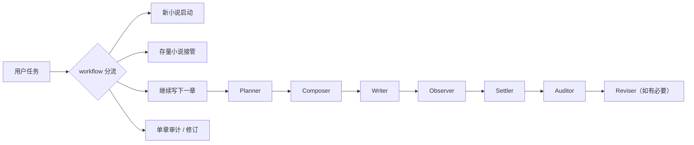

# novel-pro


> 短篇可以靠灵感，长篇必须靠系统。  
> `novel-pro` 不是帮你多写一点，而是帮你从第 1 章稳到第 100 章。
>
> 面向长篇中文小说的多角色写作技能。  
> 不是单一提示词，而是一套可分流、可接管、可审计、可结算的小说工作流系统。

## 目录

- [简介](#简介)
- [适用场景](#适用场景)
- [核心能力](#核心能力)
- [为什么不用单提示词，而要用工作流](#为什么不用单提示词而要用工作流)
- [快速开始](#快速开始)
- [工作流入口](#工作流入口)
- [标准创作流水线](#标准创作流水线)
- [新书启动机制](#新书启动机制)
- [真相系统](#真相系统)
- [典型工作流示例](#典型工作流示例)
- [项目结构](#项目结构)
- [仓库结构](#仓库结构)
- [使用方式](#使用方式)
- [最佳实践](#最佳实践)
- [FAQ](#faq)
- [设计原则](#设计原则)
- [子角色说明](#子角色说明)
- [模板与初始化](#模板与初始化)
- [合规与致谢](#合规与致谢)
- [当前状态](#当前状态)
## 简介

`novel-pro` 用来解决长篇小说创作里最容易失控的几件事：

- 写到后面人物和设定开始漂移
- 伏笔埋了很多却没有稳定回收机制
- 已有小说很难被 AI 安全接管
- 写完正文后没有统一的结算与审计流程
- 上下文越堆越大，模型越来越容易乱写

它把小说任务拆成 `workflow + agent + 真相系统` 三层：

- `workflow` 决定当前任务属于哪种场景，以及应该先做什么
- `agent` 负责执行单步任务，例如规划、写作、观察、结算、审计、修订
- `真相系统` 负责把章节事实沉淀成可追溯的总账与快照视图

目标不是“帮你多写一点”，而是**帮你把长篇小说写稳**。

## 适用场景

- 从零启动一本新小说
- 接管一个已经写了若干章的存量小说
- 在已有真相文件基础上继续写下一章
- 对某一章做审计、修订和补结算

## 核心能力

- **新书启动**：先判断用户是否已有创作思路，再通过标准化问答建立项目骨架
- **存量接管**：逐章读取、逐章结算、不可跳章、不可预读
- **继续写作**：只有在待同步章节清空后，才允许进入下一章创作
- **章节结算**：先写事实总账，再刷新快照视图
- **审计修订**：通过 `Auditor + Reviser` 构成章节质量回路
- **上下文控制**：先读 workflow，再按需读 agent 与 references，避免提示词膨胀

## 为什么不用单提示词，而要用工作流

| 对比项 | 单提示词写小说 | `novel-pro` 工作流 |
|---|---|---|
| 上下文管理 | 容易越写越肿，后期信息混乱 | 先分流，再按需读取，控制上下文体积 |
| 连续性 | 主要靠模型临时记忆，长篇容易漂 | 用真相文件、总账和快照维持连续性 |
| 存量接管 | 很难安全接手已有正文 | 可逐章读取、逐章结算接管旧项目 |
| 写后处理 | 通常写完就结束 | 写完还会走观察、结算、审计、修订 |
| 事实追溯 | 很难说清某个结论从哪来 | 当前状态可回链到章节事实与 `fact_id` |
| 门禁控制 | 容易边没补账边继续写 | 待同步章节未清空时禁止续写 |
| 协作稳定性 | 高度依赖单次 prompt 质量 | 用固定 workflow 和 agent 拆分职责 |

如果只是写一篇短篇、一次性片段，单提示词可能已经够用。

如果要写的是**会持续推进、需要回收伏笔、需要接管旧稿、需要长期稳定产出的长篇小说**，工作流会更稳。

## 快速开始

### 场景 1：从零启动一本新小说
直接告诉 AI：

```text
用 novel-pro 帮我创建一本新小说项目。
```

系统会先：
- 判断你是否已经有创作思路
- 进入标准启动问答
- 创建目录、模板和真相文件
- 输出启动摘要
- 决定是否直接进入首章写作

### 场景 2：接管一部已经写过的小说
直接告诉 AI：

```text
用 novel-pro 接管这个小说项目。
```

系统会先：
- 检查目录结构是否完整
- 补齐缺失的真相文件骨架
- 从 `故事/同步状态.md` 判断进度
- 从下一章开始逐章读取、逐章结算

### 场景 3：继续写下一章
直接告诉 AI：

```text
用 novel-pro 继续写下一章。
```

系统会先：
- 检查 `故事/同步状态.md`
- 确认没有待同步章节
- 执行固定流水线写作、结算、审计

### 场景 4：只审计或修某一章
直接告诉 AI：

```text
用 novel-pro 审计第12章。
```

或：

```text
用 novel-pro 修第12章，但不要改动其他章节。
```

## 工作流入口

`novel-pro` 当前围绕四个入口组织：

1. **新小说启动**
   先判断用户是否有现成思路，再进入“启动问答 -> 初始化目录 -> 回填模板 -> 是否开写首章”
2. **存量小说接管**
   先补齐真相文件骨架，再逐章 `Observer -> Settler`
3. **继续写下一章**
   在同步状态允许的前提下，执行 `Planner -> Composer -> Writer -> Observer -> Settler -> Auditor`
4. **单章审计 / 修订**
   只处理目标章节，不默认推进后续章节

## 标准创作流水线



## 新书启动机制

新书不是直接建空目录，而是先走结构化启动流程。

### 第0问：有没有创作思路
- 有：先吸收用户已有设定，再只补缺失项
- 没有：先引导式立项，再建项目

### 启动八问
新书启动阶段会围绕以下八类信息建立项目口径：

- 题材
- 世界观基调
- 主角身份
- 开局处境
- 主线冲突
- 篇幅与推进方式
- 文风与读感
- 禁区与必须避免项

问完之后，不是直接开始写，而是先输出一份**启动摘要**，再回填到初始化文件中。

## 真相系统

`novel-pro` 采用“两层真相”设计：

### 1. 事实总账
记录每一章真正发生了哪些变化，适合追溯。

### 2. 快照视图
记录故事当前状态，适合继续写下一章。

快照不保留长流水历史，重点保留“当前仍然有效”的信息。这样可以同时做到：

- 事实可追溯
- 工作文件不无限膨胀
- 后续续写时上下文更轻

## 典型工作流示例

### 示例 1：我只有一个模糊想法
场景：你只知道“想写一本星际修真小说”，但没有完整设定。

系统会这样推进：
1. 先问你有没有现成思路
2. 用启动问答补齐题材、主角、主冲突、篇幅、风格和禁区
3. 输出启动摘要
4. 创建小说项目目录与模板文件
5. 如果你同意，再进入首章写作与结算

### 示例 2：我已经写了 20 章旧稿
场景：目录里已经有 `第01章.md` 到 `第20章.md`。

系统会这样推进：
1. 先检查 `故事/`、`总账/`、`同步状态.md` 是否存在
2. 缺失文件先从模板补齐
3. 从第1章或下一待同步章开始
4. 严格逐章读取、逐章结算
5. 全部补齐后，才允许继续写第21章

### 示例 3：我已经同步完，只想继续第21章
场景：真相文件已齐备，`同步状态.md` 显示没有待同步章节。

系统会这样推进：
1. 检查门禁是否通过
2. 生成章节意图
3. 压缩上下文包
4. 写正文
5. 提取事实变化
6. 结算到总账与快照
7. 审计通过后推进到下一章

## 项目结构

初始化后的小说项目通常采用如下结构：

```text
小说项目根目录/
├── 00-大纲.md
├── 章节/
├── 故事/
│   ├── 当前状态.md
│   ├── 资源账本.md
│   ├── 伏笔池.md
│   ├── 章节摘要.md
│   ├── 支线进度.md
│   ├── 情感弧线.md
│   ├── 角色矩阵.md
│   ├── 作者意图.md
│   ├── 当前焦点.md
│   ├── 同步状态.md
│   └── 总账/
│       ├── README.md
│       ├── 事实总账.md
│       └── 索引.md
└── 运行时/
    └── 章节意图.md
```

## 仓库结构

```text
novel-pro/
├── SKILL.md
├── README.md
├── ACKNOWLEDGEMENTS.md
├── LICENSE
├── workflows/
├── agents/
├── references/
├── scripts/
├── templates/
```

各目录职责：

- `SKILL.md`：主入口，只负责分流和全局规则
- `workflows/`：场景级操作说明
- `agents/`：单步执行说明
- `references/`：按需读取的参考材料
- `templates/`：项目初始化与运行时模板
- `scripts/`：辅助脚本

## 使用方式

### 1. 新建小说项目
适用于从零开始立项。

AI 应先：
- 判断用户是否已有创作思路
- 通过标准问答补齐关键信息
- 创建目录与模板文件
- 输出启动摘要
- 决定是否直接进入首章写作

### 2. 接管已有小说
适用于已经存在正文文件的项目。

AI 应先：
- 盘点结构是否齐全
- 缺文件先补模板骨架
- 从 `同步状态.md` 判断已同步进度
- 从下一章开始逐章读取、逐章结算

### 3. 继续写下一章
适用于真相文件已经齐备、且没有待同步章节的项目。

AI 应先：
- 检查 `故事/同步状态.md`
- 确认允许续写
- 按固定流水线写作、结算、审计

### 4. 单章审计 / 修订
适用于只处理一个目标章节。

AI 应先：
- 读取目标章节与相关快照
- 进行审计
- 若用户要求修，再定点修订
- 若修订改变事实，再补结算

## 最佳实践

- 新书启动时，先走问答和启动摘要，不要直接跳进首章。
- 接管旧稿时，坚持逐章读取、逐章结算，不要跳章补账。
- `故事/同步状态.md` 是门禁文件，待同步章节未清空时不要续写。
- 任何章节结算都遵循“先总账，再快照”。
- 修订章节时，先判断是否真的改变事实；若没有改事实，不要无意义改总账。
- references 只按需读取，不要把所有参考文件整包塞进上下文。

## FAQ

### 为什么不用一个大提示词直接写完整本小说？
因为短篇可以靠一次性 prompt 撑住，长篇通常撑不住。章节越多，人物、设定、伏笔、信息边界越容易漂，工作流能把这些职责拆开并落账。

### 为什么接管旧稿时不能跳章？
因为真相系统依赖逐章结算。跳章会直接破坏状态连续性，导致后面的快照和总账都不可信。

### 为什么必须先写总账，再写快照？
总账负责记录“发生过什么”，快照负责记录“现在是什么状态”。如果不先落总账，快照就会失去可追溯来源。

### 用户没有创作思路怎么办？
不会直接建空项目，而是先进入引导式立项，通过标准问答帮助用户把题材、主角、冲突、篇幅、文风和禁区定下来。

## 设计原则

- **先分流，再执行**：先命中 workflow，再调用 agent
- **不跳章、不预读**：尤其在接管模式下必须严格执行
- **事实优先于摘要**：正文冲突时，以当前复核正文为准
- **先总账，再快照**：结算顺序不可颠倒
- **快照只保留当前值**：历史变化统一进总账
- **references 按需读取**：不把所有参考材料默认塞进上下文

## 子角色说明

- `Planner`：产出章节意图
- `Composer`：压缩上下文包
- `Writer`：生成正文
- `Observer`：抽取本章事实
- `Settler`：写总账并刷新快照
- `Auditor`：审计正文
- `Reviser`：定点修订

## 模板与初始化

初始化项目时，优先复用 `templates/` 中的模板：

- `templates/大纲.md` -> `00-大纲.md`
- `templates/运行时/章节意图.md` -> `运行时/章节意图.md`
- `templates/故事/*.md` -> `故事/*.md`
- `templates/故事/总账/*.md` -> `故事/总账/*.md`

这能保证项目结构、字段口径和后续工作流保持一致。

## 合规与致谢

本项目按 **GNU Affero General Public License v3.0（AGPL-3.0）** 发布。

在设计与实现过程中，`novel-pro` 参考并改写了 [`Narcooo/inkos`](https://github.com/Narcooo/inkos) 的部分提示词、工作流和角色拆分思路。由于该项目以 **AGPL-3.0** 发布，且本项目使用并改写了其中受该许可证约束的内容，因此本项目同样按 **AGPL-3.0** 开源发布。

详见：

- [LICENSE](./LICENSE)
- [ACKNOWLEDGEMENTS.md](./ACKNOWLEDGEMENTS.md)

## 当前状态

`novel-pro` 更像一个持续演化的小说工作系统，而不是一组一次性提示词。

如果你想要的是一套能从第 1 章稳定推进到第 30 章、再推进到更长篇幅的写作技能，它就是朝这个方向构建的。

